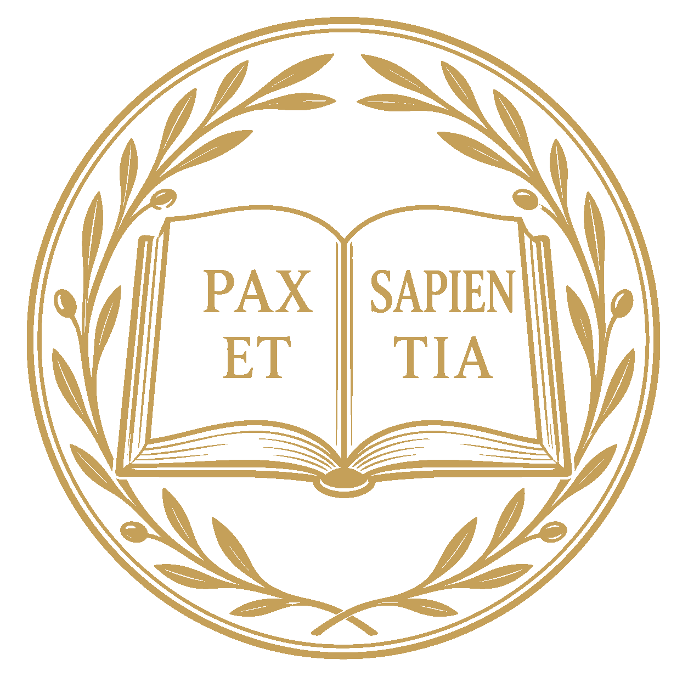

# Fondazione Benedettina Pax et Sapientia - ETS

<p align="center">
  
</p>

<p align="center">
  <strong>Pace e Sapienza per un futuro sostenibile.</strong><br />
  <em>Peace and Wisdom for a sustainable future.</em>
</p>

---

## 🏛️ About the Foundation

The **Benedictine Foundation Pax et Sapientia - ETS** is an Italian Third Sector Entity (Ente del Terzo Settore) dedicated to the promotion of human values, cultural heritage, and environmental stewardship. Inspired by the values of solidarity and participation, the Foundation operates with the goal of fostering a more conscious and educated society.

### Core Pillars
- **🎨 Culture & Art:** Promotion and dissemination of artistic and historical research.
- **🌿 Environment:** Protection, enhancement, and sustainable management of cultural and natural landscapes.
- **🎓 Education:** Permanent training, vocational instruction, and scientific social research.
- **🕊️ Peace:** Promotion of the culture of legality, non-violence, and international cooperation.

---

## 🌐 Website Project

This repository contains the source code for the official foundation website, hosted on **Cloudflare Pages**.

### Key Features
- **Bilingual Support (i18n):** Native support for Italian (`/`) and English (`/en/`).
- **Responsive Design:** Optimized for all devices, from mobile phones to high-resolution desktops.
- **Legal Compliance:** Fully compliant with Italian ETS transparency requirements and EU GDPR regulations.
- **High Performance:** Built with **Astro** for near-instant loading speeds and excellent SEO.

### Tech Stack
- **Framework:** [Astro](https://astro.build/) (Static Site Generator)
- **Styling:** [Tailwind CSS](https://tailwindcss.com/)
- **Fonts:** [Fontsource](https://fontsource.org/) (Self-hosted Inter & Playfair Display)
- **Deployment:** [Cloudflare Pages](https://pages.cloudflare.com/)

---

## 🛠️ Development

### Prerequisites
- [Node.js](https://nodejs.org/) (latest LTS version recommended)
- [npm](https://www.npmjs.com/)

### Getting Started
1. **Clone the repository:**
   ```bash
   git clone https://github.com/pax-et-sapientia/pax-et-sapientia-website.git
   cd pax-et-sapientia-website
   ```

2. **Install dependencies:**
   ```bash
   npm install
   ```

3. **Start the development server:**
   ```bash
   npm run dev
   ```
   Open [http://localhost:4321](http://localhost:4321) to see the result.

### Build for Production
To generate a static version of the site for deployment:
```bash
npm run build
```
The output will be located in the `dist/` directory.

---

## 📍 Legal Info
- **Registered Office:** Piazza dei Cavalieri di Malta, 5 - 00153 Roma, Italy
- **Codice Fiscale:** 96643590589
- **PEC:** [FONDAZIONEBENEDETTINAPAXETSAPIENTIA_ETS@LEGALMAIL.IT](mailto:FONDAZIONEBENEDETTINAPAXETSAPIENTIA_ETS@LEGALMAIL.IT)

---

<p align="center">
  © 2026 Fondazione Benedettina Pax et Sapientia - ETS. Tutti i diritti riservati.
</p>
